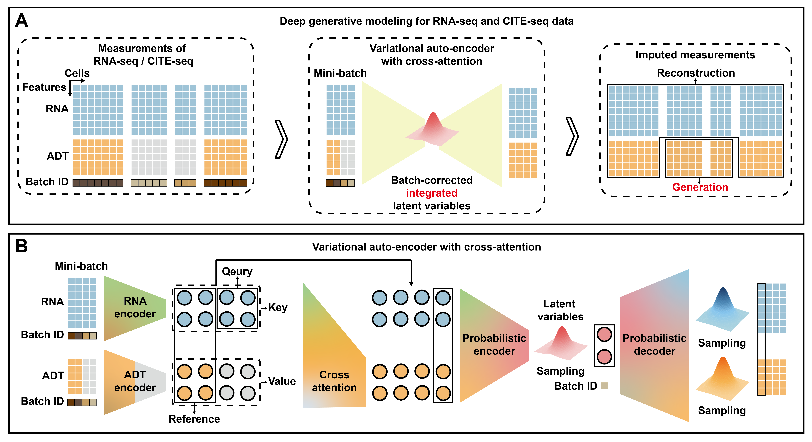
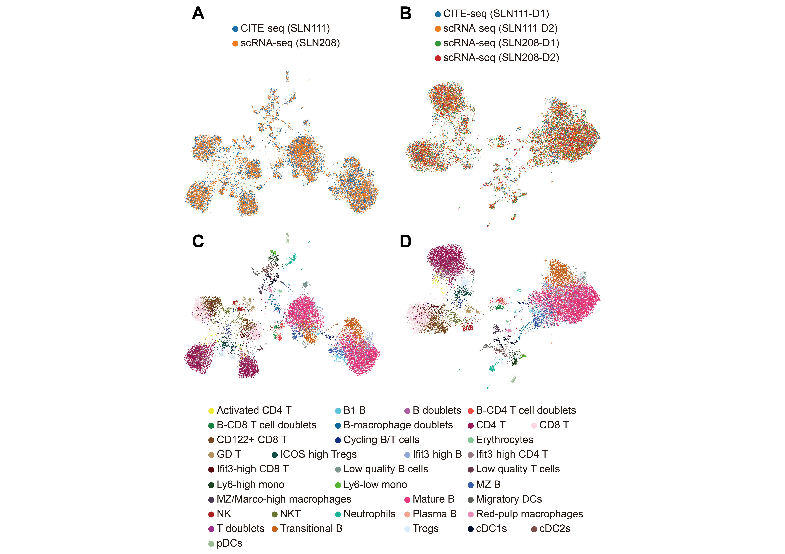

===================================
Welcome to scProca's documentation!
===================================
.. image:: https://readthedocs.org/projects/scproca/badge/?version=latest
    :target: https://scproca.readthedocs.io/en/latest/?badge=latest
    :alt: Documentation Status

**scProca** is a package designed to integrate and generate single-cell proteomics from transcriptomics, implemented in PyTorch.

----
News
----

.. raw:: html

   <h3 style="color:red; font-size:20px; font-weight:bold;">2025-1-31: A more accurate and detailed version of research paper has been preprinted on bioRxiv <a href="https://doi.org/10.1101/2025.01.28.635217" target="_blank">https://doi.org/10.1101/2025.01.28.635217</a> (2025).</h3>

------------
Introduction
------------

Overview of scProca. (A) Schematic representation of scProca within the framework of deep generative models. scProca is capable of inferring batch-corrected, integrated latent variables from scRNA-seq and CITE-seq data, and generating the expression profiles of ADT for scRNA-seq cells. (B) The variational auto-encoder with cross-attention introduced in scProca. Cross-attention is used to incorporate CITE-seq cells as references, completing representation of scRNA-seq cells in the ADT embedding space.

UMAP visualization of the low-dimensional representations obtained by scProca on the SLN dataset, colored by batch annotation and cell types. Color by batch annotation: (A) Only SLN111-D1 serves as CITE-seq data, while the others serve as scRNA-seq data. (B) Both SLN111-D1 and SLN111-D2 serve as CITE-seq data, while both SLN208-D1 and SLN208-D2 serve as scRNA-seq data. Color by cell types: (C) Same setup as (A). (D) Same setup as (B).

.. toctree::
   :maxdepth: 1
   :caption: Installation and Reproducibility

   pre

.. toctree::
   :maxdepth: 1
   :caption: Jupyter notebooks for examples

   Integrate and generate CITE-seq PBMC Datasets from scRNA-seq PBMC Datasets
   Integrate and generate CITE-seq SLN Datasets from scRNA-seq SLN Datasets
   Integrate and generate CITE-seq SLN Datasets from scRNA-seq SLN Datasets using experimental batches

.. toctree::
   :maxdepth: 1
   :caption: Main functions and parameters

   api

--------
Citation
--------

Jiankang Xiong, Shuqiao Zheng, Fuzhou Gong, Liang Ma and Lin Wan. "Integrate and generate single-cell proteomics from transcriptomics with cross-attention." Preprint at bioRxiv https://doi.org/10.1101/2025.01.28.635217 (2025).

