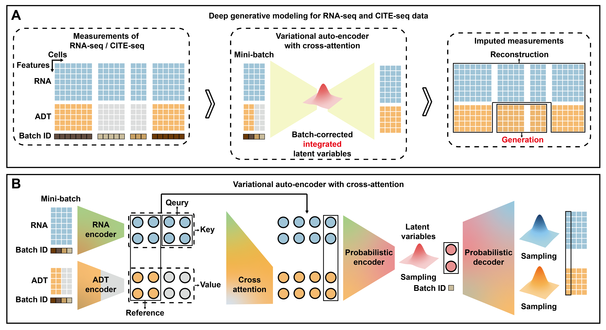
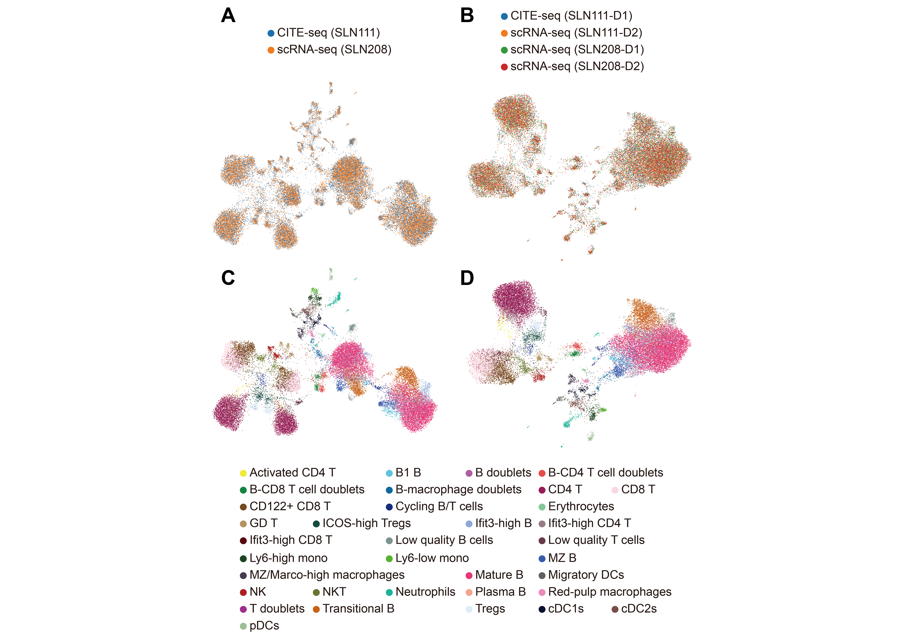

# scProca - Integrate and generate single-cell proteomics from transcriptomics with cross-attention

[](https://scproca.readthedocs.io/en/latest/?badge=latest)

`scProca` is a package designed to integrate and generate single-cell proteomics from transcriptomics, implemented in PyTorch.

---

## News

<span style="color:red;font-size:20px; font-weight:bold;">2025-1-31: A more accurate and detailed version of research paper has been preprinted on bioRxiv https://doi.org/10.1101/2025.01.28.635217 (2025).</span>

---

## Introduction


Overview of scProca.  
(A) Schematic representation of scProca within the framework of deep generative models.  
(B) The variational auto-encoder with cross-attention introduced in scProca.


UMAP visualization of the low-dimensional representations obtained by scProca on the SLN dataset, colored by batch annotation and cell types.   
(A-C) Only SLN111-D1 serves as CITE-seq data, while the others serve as scRNA-seq data.  
(B-D) Both SLN111-D1 and SLN111-D2 serve as CITE-seq data, while both SLN208-D1 and SLN208-D2 serve as scRNA-seq data. 

---

## Installation

1. Install Conda and create a virtual environment with `python==3.11`:

   ```bash
   conda create -n scProca python==3.11
   conda activate scProca
   ```

2. Install [PyTorch](https://pytorch.org) in the virtual environment. If you have an NVIDIA GPU, make sure to install a version of PyTorch that supports it. PyTorch performs much faster with an NVIDIA GPU. For maximum compatibility, we currently recommend installing `pytorch==2.3.1`.

3. Install scProca from GitHub:

   ```bash
   git clone git://github.com/xiongbiolab/scProca.git
   cd scProca
   pip install .
   ```

---

## Documentation

Detailed usage documentation is available at https://scProca.readthedocs.io.

---

## Reproducibility

Replication code for the research paper is available at https://github.com/ZzzsHuqiaAao/scProca-reproducibility.

---

## Citation

Jiankang Xiong, Shuqiao Zheng, Fuzhou Gong, Liang Ma and Lin Wan. "Integrate and generate single-cell proteomics from transcriptomics with cross-attention." Preprint at bioRxiv https://doi.org/10.1101/2025.01.28.635217 (2025).
